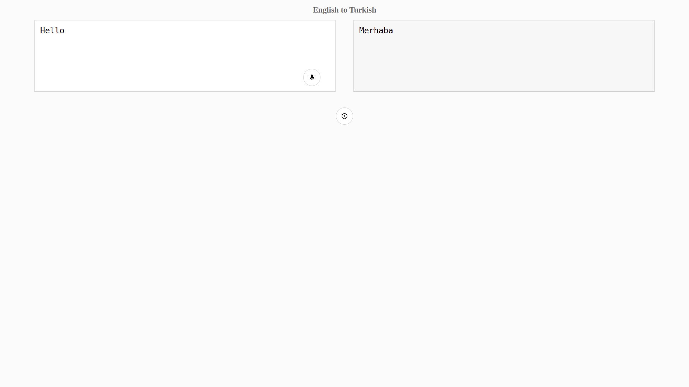

# Translator

> A translator that can translate both spoken and written English to Turkish.

---



---

## Built With

- React, Redux, Sass
- Web API Speech Recognition
- Argosopentech Translate API
- React uuid
- Jest

## Live Demo (if available)

[Live Demo Link](https://translatorastronaut.netlify.app/)


## Getting Started

To get a local copy up and running follow these simple example steps.

- Clone repository to computer.

```
git clone https://github.com/luftedar/astronaut.git
```

- cd into the file

```
cd astronaut
```

- Install npm

```
npm install
```

- Start local server

```
npm start
```

### Prerequisites

- Node (v16.13.0)
- Npm (8.1.0)
- Google Chrome Web Browser

### Run tests

- Run following to test application.

```
npm test
```


## Authors

👤 **Orçun Uğur**

- GitHub: [luftedar](https://github.com/luftedar)
- LinkedIn: [orcunugur](https://www.linkedin.com/in/orcunugur)

## 🤝 Contributing

Contributions, issues, and feature requests are welcome!

Feel free to check the [issues page](../../issues/).

## Show your support

Give a ⭐️ if you like this project!

## Acknowledgments

- Thanks [AppSamurai](https://appsamurai.com/) for this greate assestment.

## 📝 License

This project is [MIT](./MIT.md) licensed.
